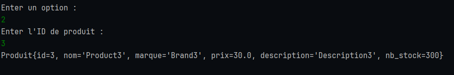

<div align="center">

# La généricité

</div>

### Créez une classe Produit avec les attributs id, nom, marque, prix, description, et nombre en stock.


### Créer une Interface générique IMetier qui va déclarer les méthodes pour gérer nos entités Produit. Cette interface a un type générique T et contient les méthodes suivantes :

-  `public void add(T o)` : qui permet d’ajouter un objet à la liste.

-  `public List<T> getAll()` : qui retourne la liste des objets sous forme d’une liste.

-  `public T findById(long id)` : qui retourne un produit par id.

-  `public void delete(long id)` : qui supprime un objet par id.


### - Créer une classe MetierProduitImpl qui implémente l’interface IMetier. Cette classe contient un attribut qui représente une liste de produits.


### Ecrire une classe Application contenant la méthode main qui propose à l’utilisateur dans une boucle while le menu suivant :
```pyton
1. Afficher la liste des produits.
2. Rechercher un produit par son id.
3. Ajouter un nouveau produit dans la liste.
4. Supprimer un produit par id.
5. Quitter ce programme.
   ```


## Demo

- afficher les produits


- Recherche un produit



- Ajouter un produit


- Supprimer un produit


- Quitter le programe


